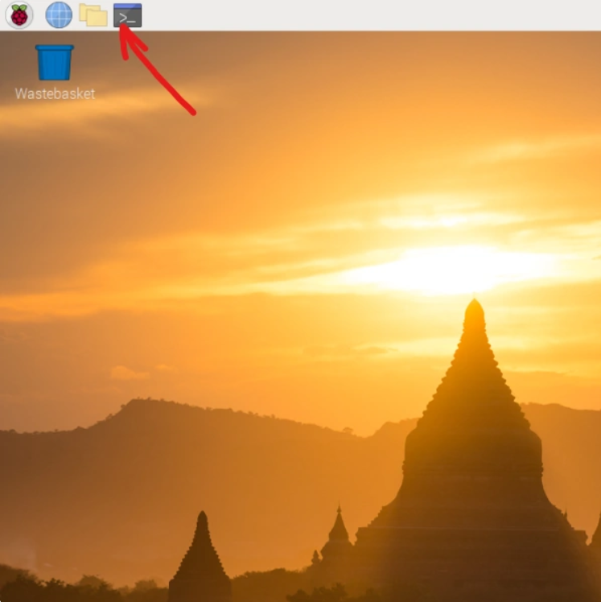

# Projects-with-Raspberri-Pi4B

## I. Stop Sleeping and Safe mode
  
 ###### 1. Power Safe Mode

		iw wlan0 get power_save
		
		sudo iw wlan0 set power_save off

 ###### 2. Disable sleeping on Raspberry pi

		sudo apt-get install xscreensaver

Once installed, go to Rpi's desktop "Menu" (left top corner)

Go to preference ==> screensaver.

You will see a screen saver main menu. In the mode drop-down menu, select "disable screensaver" then close the window.

Reboot the Raspberry PI.
	
###### 3. Steps to disable Screen Blanking or Sleeping with the Raspberry Pi:

Click on the Menu button on the upper right (Raspberry Pi Icon) ==> Preferences ==> Raspberry Pi Configuration.
	

	
In Raspberry Pi Configuration Window, click on Display Tab.

Look for the Screen Blanking row, click Disable. Then click OK.

 

A window will open and asks if you like to reboot the Raspberry Pi. Click Yes.

## II.	Install Anydesk

	wget https://download.anydesk.com/rpi/anydesk_6.1.1-1_armhf.deb

Run it into Desktop version, with double click under downloaded file.

Start it automatically on startup.

	which anydesk
		*/usr/bin/anydesk
		
	sudo nano /etc/xdg/lxsession/LXDE-pi/autostart
		@/usr/bin/anydesk

## III.	DIY Raspberry Pi UPS

	sudo mkdir /opt/check_lan
	
	sudo pico /opt/check_lan.sh

Copy this for the script

	#!/bin/sh

	# cron script for checking lan connectivity
	# change 192.168.10.1 to whatever IP you want to check.
	IP_FOR_TEST="192.168.10.1"
	PING_COUNT=1

	PING="/bin/ping"
	IFUP="/sbin/ifup"
	IFDOWN="/sbin/ifdown --force"

	INTERFACE="eth0"

	FFLAG="/opt/check_lan/stuck.fflg"

	# ping test
	$PING -c $PING_COUNT $IP_FOR_TEST > /dev/null 2> /dev/null
	if [ $? -ge 1 ]
	then
    		logger "$INTERFACE seems to be down, trying to bring it up..."
        	if [ -e $FFLAG ]
        	then
                	logger "$INTERFACE is still down, shutting down..."
                	rm -f $FFLAG 2>/dev/null
                	sudo shutdown -h -t 0
        	else
                	touch $FFLAG
                	logger $(sudo $IFDOWN $INTERFACE)
                	sleep 10
                	logger $(sudo $IFUP $INTERFACE)
        	fi
	else
	#    logger "$INTERFACE is up"
    	rm -f $FFLAG 2>/dev/null
	fi

After run this command:

	sudo chmod 700 /opt/check_lan.sh
	
	sudo pico /etc/crontab

Add this line so that our script runs every two minutes:

	*/2 * * * * root /opt/check_lan.sh >/dev/null

## IV. Install Samba Server

Video: https://www.youtube.com/watch?v=aFLeCyGaSR0&t=110s

	sudo raspi-config
	
	sudo apt-get install ntfs-3g
	
	sudo fdisk –l
	
	sudo mkdir /media/NASHDD1
	
##### • if we want to mount second USB

	sudo mkdir /media/NASHDD2
	
	sudo useradd admin -m -G users
	
	sudo passwd admin
	
	id -u admin
		1001 or other
	id -g admin
		1001 or other
		
	sudo nano /etc/fstab

before # we have to write:

	/dev/sda1	/media/NASHDD1	auto	uid=1001,gid=1001,noatime	0 0
	
##### •if we want to mount second USB

	/dev/sdb1	/media/NASHDD2	auto	uid=1001,gid=1001,noatime	0 0

Hit: CTRL+X ==> Y ==> hit Enter

	sudo reboot

	sudo apt-get install samba samba-common-bin

	sudo cp /etc/samba/smb.conf /etc/samba/smb.conf.old

	sudo nano /etc/samba/smb.conf

On end of lines we add:
	
	[NASHDD1]
	comment = NAS Folder
	path = /media/NASHDD1
	valid users = @users
	force group = users
	create mask = 0660
	directory mask = 0771
	read only = no
	
##### •if we want to mount second USB

	[NASHDD2]
	comment = NAS Folder
	path = /media/NASHDD2
	valid users = @users
	force group = users
	create mask = 0660
	directory mask = 0771
	read only = no

Hit: CTRL+X ==> Y ==> hit Enter

	sudo /etc/int.d/samba restart

Start Samba:

	sudo service smbd start

Stop Samba:

	sudo service smbd stop

Restart Samba:

	sudo service smbd restart

Set Password:

	sudo smbpasswd -a admin

From PC add Map network \\IP >> Browse

## V. Enable SMB1 on Windows 10

Press Windows Key + R to bring up the run dialog and type: optionalfeatures

Expand “SMB 1.0/CIFS File Sharing Support” and then check the box next to “SMB 1.0/CIFS Client“

Click OK.

The installation will now proceed and you should be able to access shares using the SMB 1 Protocol again.

gpedit.msc

Computer configuration >> Administrative Templates >> Network >> Lanman Workstation

On your right side, you should see a setting called Enable insecure guest logons. 

Double-click on it, and change the setting to Not Configured to Enabled and save your change.

## VI.	Connect and Program an OLED Display For Raspberry Pi

##### 1. Hardware Connection

	Below are the connections of OLED module with Raspberry Pi 4 Model B:

 
		
SDA ==> GPIO 2 (pin 3)
SCL ==> GPIO 3 (pin 5)
VCC ==> 3.3V (pin 1)
GND ==> GND (pin 9)

##### 2. Enable I2C Interface

The I2C interface is disabled by default so you need to enable it. You can do this within the raspi-config tool on the command line by running:

	sudo raspi-config

-	A blue screen will appear. Now select Interfacing option.
-	After this, we need to select I2C option.
-	After this, we need to select Yes and press enter and then ok.
-	After this, we need to reboot Raspberry Pi by typing below command:

	sudo reboot

The following libraries may already be installed but run these commands anyway to make sure:

	sudo apt-get install python-smbus

	sudo apt-get install i2c-tools

	sudo pip3 install Adafruit_BBIO

To find a list of the devices connected to the I2C bus on the Raspberry Pi you can use the following command:

	sudo i2cdetect -y 1

Here is the output I see on my Raspberry Pi 4 Model B:

 	0   1  2  3  4  5  6  7  8  9  a  b  c  d  e  f
	00: -- -- -- -- -- -- -- -- -- -- -- -- -- -- -- --
	10: -- -- -- -- -- -- -- -- -- -- -- -- -- -- -- --
	20: -- -- -- -- -- -- -- -- -- -- -- -- -- -- -- --
	30: -- -- -- -- -- -- -- -- -- -- -- -- 3c -- -- --
	40: -- -- -- -- -- -- -- -- -- -- -- -- -- -- -- --
	50: -- -- -- -- -- -- -- -- -- -- -- -- -- -- -- --
	60: -- -- -- -- -- -- -- -- -- -- -- -- -- -- -- --
	70: -- -- -- -- -- -- -- -- -- -- -- -- -- -- -- --

It showed the device had been detected with an address of 0x3c. This is the default hex address for this type of device.

##### 3. Downloading And Running The Adafruit Stats Script

Download the script by typing in the following commands:

	sudo python -m pip install --upgrade pip setuptools wheel

	git clone https://github.com/iziliev/Raspberry-Pi-4B-0.96-OLED.git

Next, navigate to your library’s directory:

	cd Adafruit_Python_SSD1306

Then run the setup script to install the library. Make sure that the python version you choose here matches the version you are going to run the actual script in.

	sudo python3 setup.py install

Next navigate to the examples directory in the Adafruit directory:

	cd examples

Then execute the stats script:

	python3 stats.py

##### 4. Adjusting The Display Content & Layout

The following steps are done on the Raspberry Pi OS desktop and edits to the script are made in Thonny Python IDE (which comes pre-installed).

Open up the examples folder in the Adafruit library which you were working on in the previous step and use the Thonny Python IDE to open up the stats script so that you can edit it.

Copy these two portions of the script below and paste them into your script on your Pi.

Add the following two lines to the script at the end of the “# Shell scripts for system monitoring from here” section

	cmd = "vcgencmd measure_temp |cut -f 2 -d '='"
	temp = subprocess.check_output(cmd, shell = True )

Replace the following lines in the “# Write two lines of text” section.

	draw.text((x, top), "IP: " + str(IP,'utf-8'), font=font, fill=255)
	draw.text((x, top+8), str(CPU,'utf-8') + " " + str(temp,'utf-8') , font=font, fill=255)
	draw.text((x, top+16), str(MemUsage,'utf-8'), font=font, fill=255)
	draw.text((x, top+25), str(Disk,'utf-8'), font=font, fill=255)

If want to show external drive, we can comment this line and write:

	#cmd = "df -h | awk '$NF==\"/\"{printf \"Disk: %d/%dGB %s\", $3,$2,$5}'"

	cmd = "df -h | awk '/NASHDD1/ {printf \"Disk: %d/%dGB %s\", $3,$2,$5}'"
 

First, let’s change the display size so that we’re using all of the display’s pixels so that the text is a bit clearer. This display is actually a 128 x 64 display, not the 128 x 32 display which is set by default.

 

Comment out the line near the top which sets the display size to 128 x 32:

	# disp = Adafruit_SSD1306.SSD1306_128_32(rst=RST)

And then uncomment the line which sets the display size to 128 x 64:

	disp = Adafruit_SSD1306.SSD1306_128_64(rst=RST)

Download the font PixelOperator.ttf from https://www.dafont.com/pixel-operator.font and then unzip the contents of the download.

Look for the standard pixel operator font and copy the font into the same directory as your stats script.

You’ll then need to copy the filename of your font, along with the extension, to put into the script.

Comment out the line which loads the default font:

	# Load default font.
	# font = ImageFont.load_default()

Uncomment the line which loads the replacement font and paste your filename into it, keeping the inverted commas on either side. You can also play around with the font size by editing the number after the font name, I’ve used 16 here.

	# Alternatively load a TTF font.  Make sure the .ttf font file is in the same directory as the python script!
	# Some other nice fonts to try: http://www.dafont.com/bitmap.php
	font = ImageFont.truetype('PixelOperator.ttf', 16)

Adjusting the layout is a bit of a guessing game until you get it looking the way you’d like it to, or just copy the numbers I’ve used:

	draw.text((x, top+2), "IP: " + str(IP,'utf-8'), font=font, fill=255)
	draw.text((x, top+18), str(CPU,'utf-8') + " " + str(temp,'utf-8') , font=font, fill=255)
	draw.text((x, top+34), str(MemUsage,'utf-8'), font=font, fill=255)
	draw.text((x, top+50), str(Disk,'utf-8'), font=font, fill=255)

##### 5. Setting The Script To Run Automatically On Startup

Open crontab by typing the following command into your terminal:

	crontab -e

If this is the first time you’re opening crontab then select 1 as your editor and hit enter.
Add the following line to the end of the file to run the script:

	@reboot python3 /home/pi/stats.py &

Finally, you should see something similar to the following output on OLED display:

##### 6. Running Stats.py on Startup

##### Copy the OLED stats display script and the font into your home directory.

You can easily make it so this program runs every time you boot your Raspberry Pi.

The fastest and easiest way is to put it in /etc/rc.local. Run the bellow command on terminal:

	sudo nano /etc/rc.local

Scroll down, and just before the exit 0 line, enter the following:

	sudo python /home/pi/stats.py &

Save and exit. Reboot to verify that the screen comes up on boot!

## VII.	Install OpenOffice

	sudo apt-get install openoffice.org

## VIII. How to fix ‘Cannot currently show the desktop’ on Raspberry Pi

	sudo apt-get install openoffice.org

##### 1. Reconnect temporarily a monitor to your Raspberry Pi
The black screen comes when you boot your remote Pi while it isn’t connected to a monitor and you left the default screen resolution. To solve this issue and be able to boot without a monitor connected to your remote Pi, we have to change the Pi’s screen resolution.

So, to be able to change the configurations, you temporarly need to have a monitor connected to your Pi and forget the remote connection for a short while.

Or, another option is to connect through a ssh connection. If you do it this way, the ssh interface has to be configured as ‘enabled’ on your Pi.

##### 2.Boot your Raspberry Pi and open a terminal window
Once you have back your screen on your Pi, click on the terminal icon on the taskbar (left upper corner of your screen), a terminal window will appear.

 
 
##### 3. Find out your Raspberry Pi OS version
Depending on the version of your Raspberry Pi OS, the fix will be slightly different. So before fixing the issue we have to find out which OS version we are running. If you didn’t change the default wallpaper, it’s easy to recognise:
– wallpaper with tempels (see picture above) : version 10 (Buster)
– wallpaper with lake (see picture below) : version 11 (Bullseye)

 

If you changed the wallpaper or if you are accessing your Pi through a ssh-connection, enter the following command:

	cat /etc/os-release
	
and look for the number after ‘VERSION_ID’.

Switch to root user
First, enter :
	
	sudo -s
	
##### Only for version 10 : Change the display settings in your config.txt file as follows :
Enter or copy and paste :

	echo 'hdmi_force_hotplug=1'>> /boot/config.txt
	echo 'hdmi_group=2'>> /boot/config.txt
	echo 'hdmi_mode=51'>> /boot/config.txt
	
- There are different ways how to change your display settings. In any case, these settings are kept in your config.txt file.

It’s optional, but if you want to visualise the changes you just made in your config.txt file, enter :

	nano /boot/config.txt
	
Have a look at the bottom of the file.
##### Only for version 11 : Change the display settings in the Raspberry Pi Software Configuration Tool (raspi-config) as follows :
To open the raspi-config tool, enter:

	raspi-config

Then, to be sure, we first update the tool to the latest version. Navigate with your keyboard arrows to :

	8 Update

After the Update operation, the tool will restart automatically.
Now we navigate to :

	2 Display Options
	
then to :

	D5 VNC Resolution
	
and select a resolution that suits you best. I always choose the maximum resolution :

	1920x1080
	
Click on your ‘Tab’ and then ‘Enter’ key to select the choosen resolution.
Click on ‘OK’ and then ‘Finish’ to save your settings.

##### Reboot
Now you can remove the HDMI-cable from your Pi if you want. A monitor directly connected to your Pi isn’t necessary anymore to have your screen back on the VNC viewer.
Finally, enter :
reboot

##### Reconnect remotely with your VNC viewer.
That’s it ! Now you can establish a remote connection to your Raspberry Pi again. And if you executed previous steps carefully, the black screen with ‘Cannot currently show the desktop’ won’t appear any more.

## IX.	Install Retropie

##### 1. Raspbery Setup 
##### 2. Update
##### 3.Manage package –  optional package – kodi – install from binary
##### 4. RetroPie-OLED Show Game Title on 128x64 OLED I2C Display for RetroPie v4.0.2+

This script written in Python for RetroPie project (https://retropie.org.uk/) running on Raspberry Pi 2,3, which displays all necessary info on a 128x64 OLED I2C display
Thanks to members of Raspigamer forum for all the hard work (Duritz, losernator, RiNa, Yanubis, 까먹구, 꼬락이, 뇽가뤼, 다큰아이츄, 박군, 불친절한, 부천아저씨, 스트렌져, 유령군, 지껄러뷰, 쪼딩, 초단, 캡틴하록, 키티야, 허니버터꿀, 후루뚜뚜)
##### •	HOW DOES IT WORK
First, looking for title image from 'gametitle' folder with same filename of rom.
If no match, display title name from gamelist.xml(scraped metadata).
Could not find any info, then display the file name.
##### •	Features
##### •	Current Date and Time, IP address of eth0, wlan0
##### •	CPU Temperature
##### •	Emulator name and ROM information
##### •	Title image of currently running romfile
##### •	Double-byte character set support (Korean/Chinese/Japanese)
##### •	Development Environment
##### •	Raspberry Pi 2, 3, 4
##### •	RetroPie v4.0.2 and later
##### •	128x64 OLED I2C display
##### •	Install

##### Step 1. Scrap metadata ( https://github.com/RetroPie/RetroPie-Setup/wiki/Scraper )
##### Step 2. Install Retropie-OLED Script

	cd ~
	git clone https://github.com/iziliev/RetroPie-0.96-OLED.git
	cd ./RetroPie-OLED/
	chmod 755 install.sh
	./install.sh

##### Step 3. Restart

